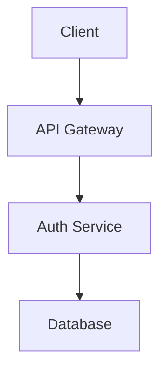
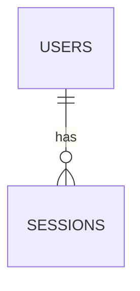
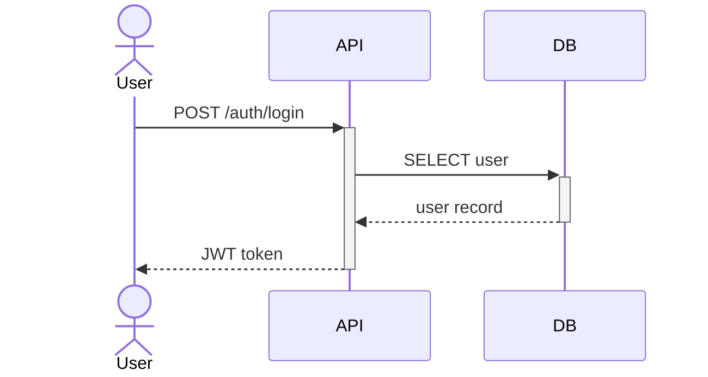

# Design: {feature-name}

> このファイルは architect エージェントが作成する。
> requirements.md（承認済み）を元に技術設計を行う。

## 概要

### 設計ゴール
{この設計が達成すること}

### 前提・制約
- {例: 既存の認証基盤は使わず新規構築}
- {例: Supabase Auth は使用しない方針}

---

## アーキテクチャ



{Mermaid図 + 必要な補足説明}

---

## API設計

### {エンドポイント名}

```
{METHOD} {path}
```

Request:
```json
{リクエストボディの例}
```

Response（成功）:
```json
{レスポンスボディの例}
```

Response（エラー）:
```json
{エラーレスポンスの例}
```

（エンドポイントごとに繰り返す）

---

## データモデル

### {テーブル名}

| カラム | 型 | 制約 | 説明 |
|---|---|---|---|
| id | UUID | PK | |
| {name} | {type} | {constraints} | {description} |

### リレーション



---

## シーケンス図

### {主要フロー名}



---

## トレードオフと代替案

| 判断 | 選択肢A | 選択肢B | 決定 | 理由 |
|---|---|---|---|---|
| {例: トークン方式} | JWT | Session | JWT | {理由} |

---

## セキュリティ考慮事項

- {例: パスワードは bcrypt（cost=12）でハッシュ化}
- {例: JWT の有効期限は15分、リフレッシュトークンは7日}
- {例: ログイン試行は5回/分にレート制限}

---

## 既存コードへの影響範囲

| ファイル/モジュール | 変更内容 | リスク |
|---|---|---|
| {パス} | {何を変えるか} | {Low/Medium/High} |

---

status: DRAFT
