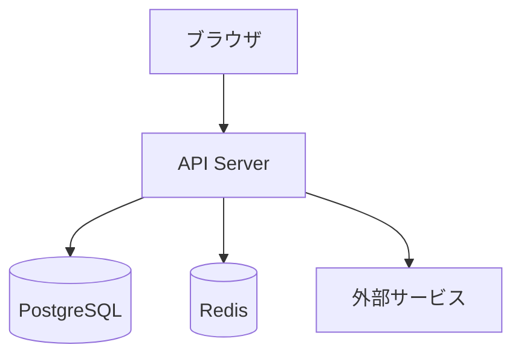
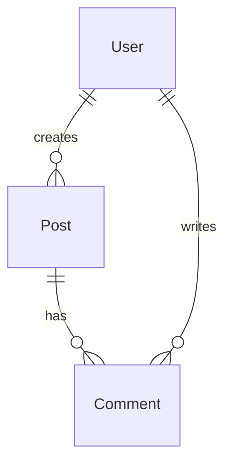
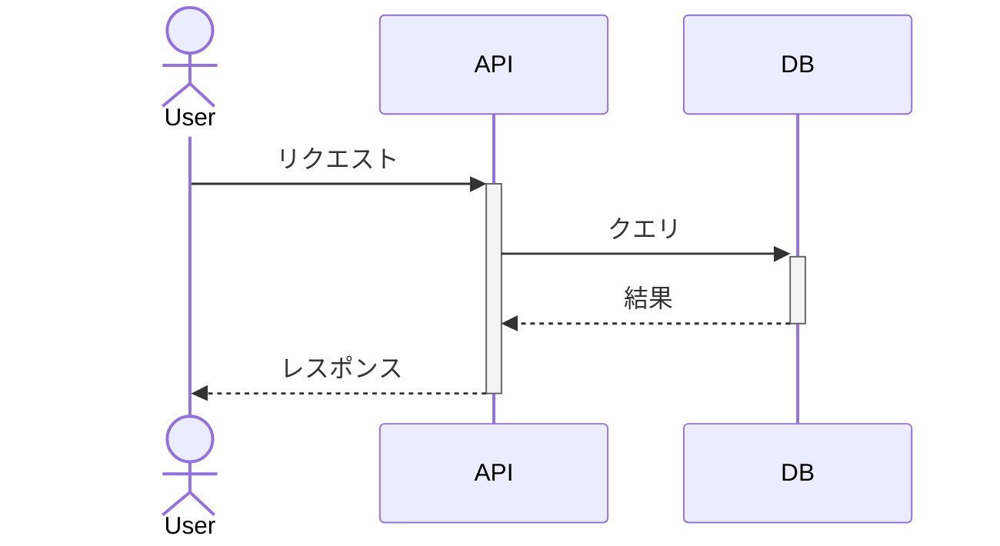

# 設計テンプレート

> Architect が specs/design.md にセクション追記する際のテンプレート。
> `## {機能名}` 見出しで追記する。

---

## {機能名}

### 設計ゴール
- {この設計で達成したいこと}

### 前提・制約
- {技術的な前提条件}

### アーキテクチャ


```mermaid
graph TD
    Client[ブラウザ] --> API[API Server]
    API --> DB[(PostgreSQL)]
    API --> Cache[(Redis)]
    API --> External[外部サービス]
```

### API設計

| Method | Path | 説明 |
|---|---|---|
| POST | /api/{resource} | {リソース作成} |
| GET | /api/{resource}/:id | {リソース取得} |

**リクエスト例:**
```json
{
  "field": "value"
}
```

**レスポンス例:**
```json
{
  "id": "xxx",
  "field": "value",
  "createdAt": "2025-01-01T00:00:00Z"
}
```

### データモデル

| カラム | 型 | 制約 | 説明 |
|---|---|---|---|
| id | UUID | PK | 一意識別子 |
| {field} | {type} | {constraint} | {description} |

**リレーション図:**

```mermaid
erDiagram
    User ||--o{ Post : creates
    Post ||--o{ Comment : has
    User ||--o{ Comment : writes
```

### シーケンス図


```mermaid
sequenceDiagram
    actor User
    User->>+API: リクエスト
    API->>+DB: クエリ
    DB-->>-API: 結果
    API-->>-User: レスポンス
```

### トレードオフと代替案

| 観点 | 採用案 | 却下案 | 理由 |
|---|---|---|---|
| {観点} | {選んだ方} | {選ばなかった方} | {なぜ} |

### セキュリティ考慮
- {入力バリデーション}
- {認証・認可}
- {データ保護}

### 影響範囲
- {既存コードへの影響}

### 変更履歴

| 日付 | 変更内容 | 理由 |
|---|---|---|

status: DRAFT
