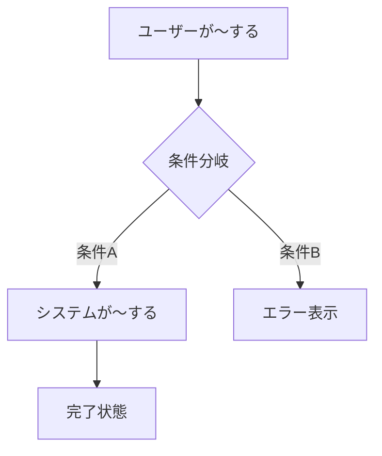

# 要件定義テンプレート

> PM が specs/requirements.md にセクション追記する際のテンプレート。
> `## {機能名}` 見出しで追記する。

---

## {機能名}

### 概要
- **解決する問題**: {何を解決するか}
- **ビジネス価値**: {なぜ作るか}
- **対象ユーザー**: {誰が使うか}

### ユーザーフロー

### 機能要件（EARS記法）

| ID | 種別 | 要件 |
|---|---|---|
| REQ-001 | Event-driven | {トリガー}が発生した場合、システムは{動作}する |
| REQ-002 | State-driven | {状態}の間、システムは{動作}する |
| REQ-003 | Unwanted | {異常}が発生した場合、システムは{対処}する |
| REQ-004 | Ubiquitous | システムは常に{制約}を満たす |

> EARS記法の種別:
> - **Ubiquitous**: 常に満たすべき制約
> - **Event-driven**: 特定イベント発生時の動作
> - **State-driven**: 特定状態での動作
> - **Unwanted**: 異常系の対処
> - **Optional**: あれば嬉しい機能

### 非機能要件

| カテゴリ | 要件 |
|---|---|
| 性能 | {例: レスポンス200ms以内} |
| セキュリティ | {例: 入力値バリデーション必須} |

### 受入基準

- [ ] {テスト可能な形で記述。例: ユーザーがメールとパスワードでログインできる}
- [ ] {例: 無効なパスワードでエラーメッセージが表示される}
- [ ] {例: 3回連続失敗でアカウントがロックされる}

### スコープ外
- {今回やらないこと}

### 変更履歴

| 日付 | 変更内容 | 理由 |
|---|---|---|

status: DRAFT
